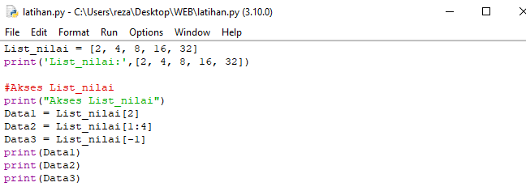
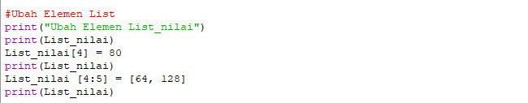
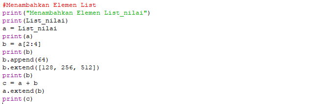
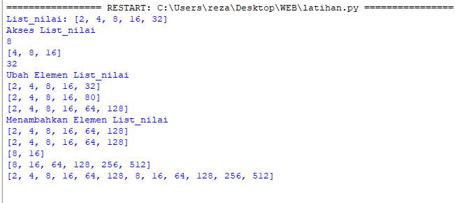
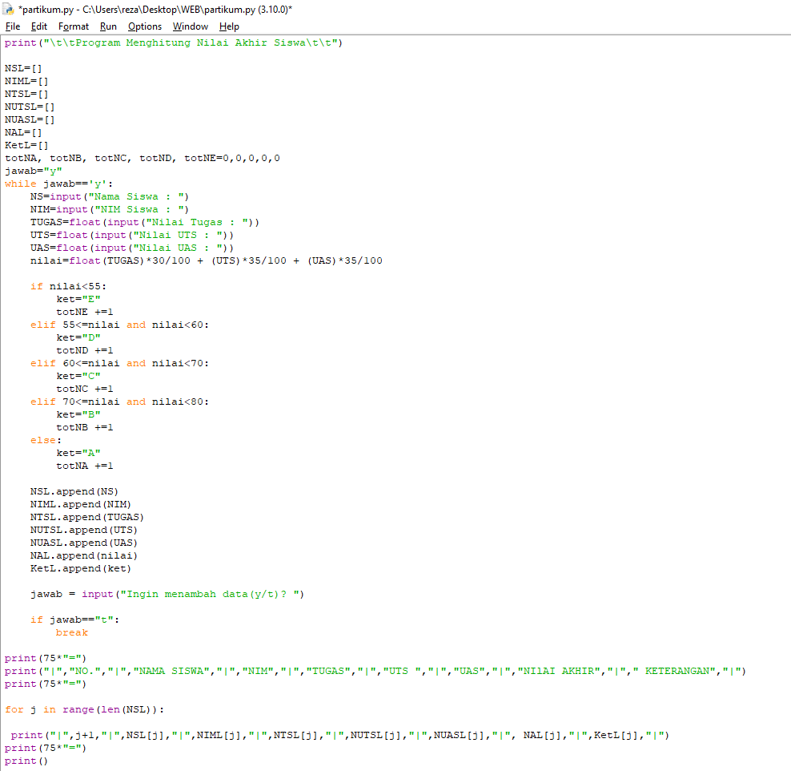
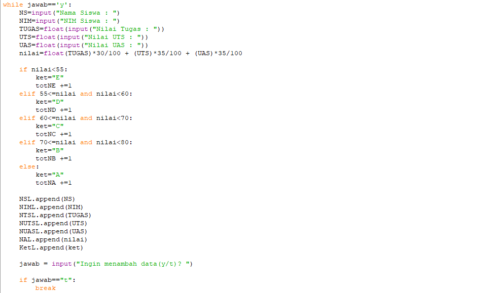
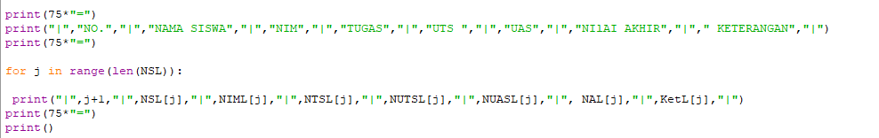
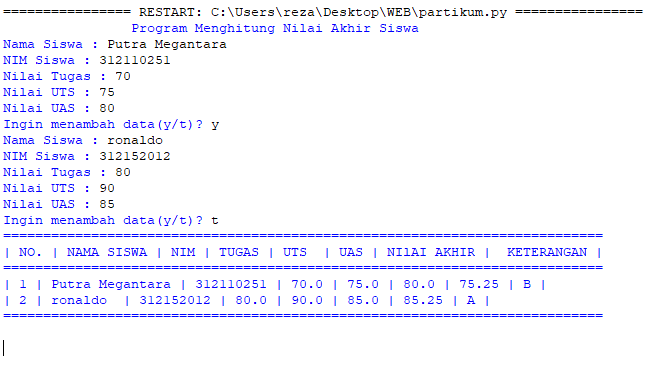
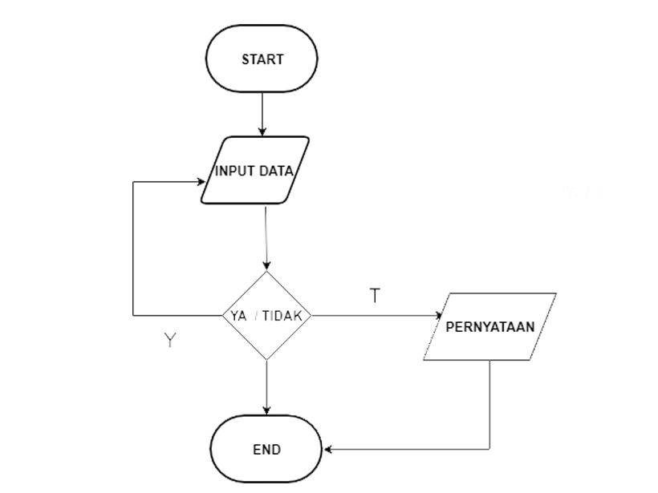

#### Labspy04

### Program Latihan 

   <p> Program sederhana untuk menambahkan data kedalam sebuah list 

   ### Penjelasan:
### List
     • Membuat list
       sebuah list didefinisikan menggunakan tanda kurung siku ([])
   
       
 ```bash
       # list kosong
         list_kosong = []
       # list yang berisi kumpulan integer
         list_nilai = [2, 4, 8, 16, 32]
       # list campuran berbagai tipe data
         list_jawaban = [50, 32.3, 'Hello',]    
 ```
    • Mengakses List
      Kita bisa menggunakan perintah print() untuk melihat isi dari sebuah list, baik secara menyeluruh maupun sebagian.

```bash
   print('list_kosong:', list_kosong)
   print('list_nilai:', list_nilai)
   print('list_jawaban:', list_jawaban)
```
### List
    • Mengubah elemen list
      tipe data yang bersifat changable alias bisa diubah.
   
  
```bash
   print("Ubah Elemen List_nilai")
   print (List_nilai)
   List_nilai [4] = 80
   print (List_nilai)
   List_nilai [4:5] = [64, 128]
   print (List_nilai)
```
    • Menambah elemen list
      - Menambah data di belakang
        kita bisa menggunakan fungsi append(). Fungsi ini menerima satu parameter, yang mana parameter tersebut akan dimasukkan sebagai nilai baru pada list, dan nilai baru tersebut berada pada akhir item.
      - Menambah data di depan
        Selain fungsi append(), kita juga bisa menambahkan item ke dalam list dengan menggunakan fungsi insert().
   

```bash
     print("Menambahkan Elemen List_nilai")
     print(List_nilai)
     a = List_nilai
     print(a)
     b = a[2:4]
     print(b)
     # tambahkan satu item ke elemen terakhir
     b.append(64)
     # tambahkan beberapa item ke elemen terakhir
     b.extend([128, 256, 512])
     print(b)
```
     • Menggabungkan list
```bash
     # gabungkan daftar a dan b ke c
     c = a + b
     # tambahkan beberapa item b ke dalam a
     a.extend(b)
     print(c)
```


## Program Pratikum



### Penjelasan:

     1. Mendeklarasikan list
        NSL=[], NIML=[], NTSL=[], NUTSL=[], NUASL=[], NAL=[], KetL=[]
     2. Gunakan perulangan while loop dengan nilai "True"
        while True:
     3. Membuat inputan data
   
     4. Membuat hasil inputan
   
   
 # Hasilnya
 

# flowchart

